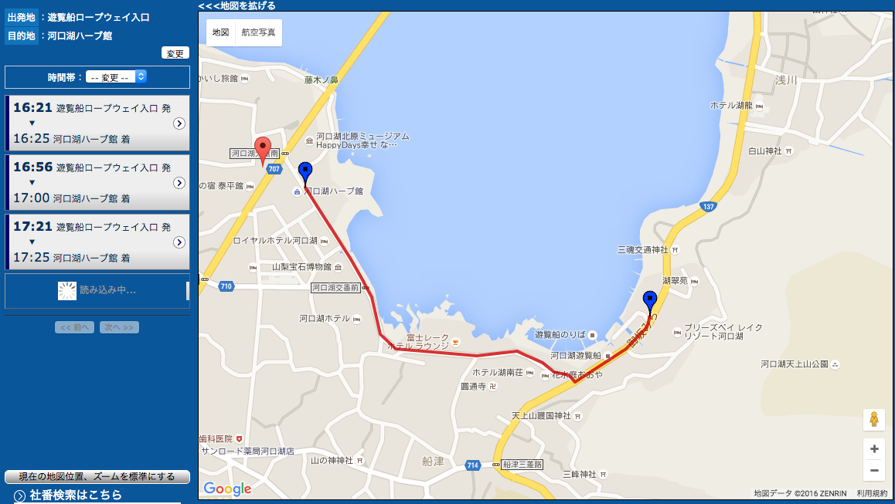

# wasm_test

Args template of Webassembly with Rust.

## dependencies

* rust >= 1.17.0
* [just](https://github.com/casey/just)
* Google Chrome (supports Webassembly)

## how to use

```sh
$ just
$ python -m SimpleHTTPServer
# and access to http://localhost:8000
```

The result will be like this,


